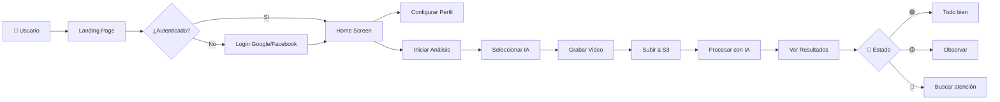

<div align="center">

# 👶 BabyHealth

### Orientación inteligente para padres primerizos

[](https://babyhealth.hmartinez.info)
[](https://flutter.dev)
[](https://aws.amazon.com)
[](https://aws.amazon.com/bedrock/)


**Analiza videos de tu bebé con IA y recibe orientación instantánea sobre su estado de salud**

[Probar Demo](https://babyhealth.hmartinez.info) · [Ver Video](#demo) · [Documentación](#arquitectura)

</div>

---

## 🎯 El Problema

Los **padres primerizos** enfrentan una constante incertidumbre sobre la salud de sus bebés:

- 😰 **Ansiedad nocturna**: ¿Mi bebé está respirando bien? ¿Por qué llora así?
- 🏥 **Visitas innecesarias a urgencias**: El 60% de las consultas de emergencia pediátricas no son urgentes
- 🌍 **Acceso limitado**: Familias en zonas rurales sin acceso rápido a pediatras
- 🗣️ **Barrera del idioma**: Padres que no dominan el idioma local en servicios de salud

## 💡 Nuestra Solución

**BabyHealth** utiliza **Inteligencia Artificial multimodal** para analizar videos de bebés y proporcionar orientación inmediata, funcionando como un **primer filtro inteligente** que ayuda a los padres a decidir cuándo es realmente necesario buscar atención médica.

### ¿Cómo funciona?

```
📱 Graba un video    →    🤖 IA analiza    →    🚦 Resultado claro    →    📋 Recomendaciones
   de tu bebé              el contenido         (Verde/Amarillo/Rojo)       personalizadas
```

---

## ✨ Características Principales

<table>
<tr>
<td width="50%">

### 🎥 Análisis de Video con IA
- Captura video directamente desde la app
- Extracción inteligente de frames clave
- Análisis multimodal con **Claude (Bedrock)** o **Gemini**
- Detección de patrones visuales del bebé

</td>
<td width="50%">

### 🚦 Sistema de Semáforo
- **🟢 Verde (Normal)**: Tu bebé parece estar bien
- **🟡 Amarillo (Atención)**: Observa y consulta si persiste
- **🔴 Rojo (Urgente)**: Busca atención médica pronto

</td>
</tr>
<tr>
<td width="50%">

### 👤 Perfil Personalizado
- Datos del bebé (nombre, fecha de nacimiento)
- Información de los padres
- Datos del pediatra de cabecera
- Contexto para análisis más precisos

</td>
<td width="50%">

### 🌐 Accesibilidad Total
- **Bilingüe**: Español e Inglés completo
- **Responsive**: Móvil, tablet y escritorio
- **Tema adaptable**: Modo claro y oscuro
- **PWA Ready**: Instalable como app nativa

</td>
</tr>
</table>

---

## 🖥️ Capturas de Pantalla

<div align="center">

| Landing Page | Selector de IA | Análisis en Proceso |
|:---:|:---:|:---:|
| Página de bienvenida con acceso rápido | Elige entre Bedrock o Gemini | Procesamiento del video |

| Resultado del Análisis | Perfil del Bebé | Configuración |
|:---:|:---:|:---:|
| Sistema de semáforo visual | Personalización del contexto | Idioma y tema |

</div>

> 📸 *Accede a la [demo en vivo](https://babyhealth.hmartinez.info) para ver la aplicación funcionando*

---

## 🏗️ Arquitectura del Sistema

```
┌─────────────────────────────────────────────────────────────────────────────┐
│                           CLIENTE (Flutter Web)                              │
│  ┌─────────────┐ ┌─────────────┐ ┌─────────────┐ ┌─────────────────────────┐│
│  │   Landing   │ │    Home     │ │   Profile   │ │    Analysis Screen     ││
│  │    Page     │ │   Screen    │ │   Screen    │ │  (Capture + Results)   ││
│  └─────────────┘ └─────────────┘ └─────────────┘ └─────────────────────────┘│
│                              │                                               │
│  ┌───────────────────────────┴───────────────────────────────────────────┐  │
│  │  AWS Amplify + Cognito (Google/Facebook OAuth)                        │  │
│  └───────────────────────────────────────────────────────────────────────┘  │
└─────────────────────────────────────┬───────────────────────────────────────┘
                                      │ HTTPS
                                      ▼
┌─────────────────────────────────────────────────────────────────────────────┐
│                        AWS CLOUDFRONT CDN                                    │
│                     babyhealth.hmartinez.info                                │
└─────────────────────────────────────┬───────────────────────────────────────┘
                                      │
                    ┌─────────────────┴─────────────────┐
                    ▼                                   ▼
┌───────────────────────────────┐     ┌───────────────────────────────────────┐
│         S3 BUCKET             │     │           API GATEWAY                 │
│     (Frontend Estático)       │     │    /analyze  /upload-url  /health     │
└───────────────────────────────┘     └───────────────────┬───────────────────┘
                                                          │
                                                          ▼
                                      ┌───────────────────────────────────────┐
                                      │           AWS LAMBDA                  │
                                      │      Python 3.11 + FastAPI            │
                                      │         (Mangum Adapter)              │
                                      └───────────────────┬───────────────────┘
                                                          │
                    ┌─────────────────┬─────────────────┬─┴─────────────────┐
                    ▼                 ▼                 ▼                   ▼
          ┌─────────────────┐ ┌─────────────────┐ ┌───────────┐ ┌─────────────────┐
          │  AWS BEDROCK    │ │  GOOGLE GEMINI  │ │    S3     │ │    DYNAMODB     │
          │ Claude Sonnet 4 │ │   (Fallback)    │ │  (Videos) │ │   (Resultados)  │
          │   Multimodal    │ │   Multimodal    │ │  TTL: 24h │ │                 │
          └─────────────────┘ └─────────────────┘ └───────────┘ └─────────────────┘
```

---

## 🛠️ Stack Tecnológico

### Frontend
| Tecnología | Uso |
|------------|-----|
| **Flutter 3.x** | Framework multiplataforma (Web, iOS, Android) |
| **Provider** | Gestión de estado reactiva |
| **AWS Amplify** | SDK de autenticación y servicios AWS |
| **SharedPreferences** | Persistencia local de configuración |

### Backend
| Tecnología | Uso |
|------------|-----|
| **Python 3.11** | Runtime del servidor |
| **FastAPI** | Framework web de alto rendimiento |
| **Mangum** | Adapter para AWS Lambda |
| **Pydantic** | Validación de datos y schemas |

### Inteligencia Artificial
| Proveedor | Modelo | Capacidad |
|-----------|--------|-----------|
| **AWS Bedrock** | Claude Sonnet 4 | Análisis multimodal (imágenes + texto) |
| **Google** | Gemini 2.5 Flash | Análisis de video nativo (alternativo) |

### Infraestructura AWS
| Servicio | Función |
|----------|---------|
| **CloudFront** | CDN global con SSL |
| **S3** | Hosting estático + almacenamiento de videos |
| **API Gateway** | REST API con throttling y autorización |
| **Lambda** | Compute serverless |
| **Cognito** | Autenticación OAuth (Google/Facebook) |
| **DynamoDB** | Base de datos de resultados |
| **Secrets Manager** | Gestión segura de API keys |
| **CDK (TypeScript)** | Infraestructura como código |

---

## 🚀 Flujo de Usuario



---

## 📁 Estructura del Proyecto

```
hackathon-Kiro/
├── 📱 frontend/                  # Flutter Web App
│   ├── lib/
│   │   ├── core/                # Configuración, temas, i18n
│   │   ├── models/              # Modelos de datos
│   │   ├── repositories/        # Capa de acceso a datos
│   │   ├── services/            # Auth, Profile, API
│   │   ├── viewmodels/          # MVVM ViewModels
│   │   ├── views/               # Pantallas UI
│   │   └── widgets/             # Componentes reutilizables
│   └── test/                    # Tests unitarios
│
├── ⚙️ backend/                   # Python FastAPI
│   ├── app/
│   │   ├── main.py              # Entry point + Mangum
│   │   ├── config.py            # Configuración centralizada
│   │   ├── routers/             # Endpoints REST
│   │   │   ├── analyze.py       # POST /analyze (Bedrock)
│   │   │   ├── analyze_gemini.py# POST /analyze-gemini
│   │   │   └── upload.py        # Presigned URLs S3
│   │   └── services/            # Lógica de negocio
│   │       ├── bedrock_service.py
│   │       ├── gemini_service.py
│   │       └── s3_service.py
│   └── lambda_package/          # Paquete desplegable
│
├── 🏗️ infra/                     # AWS CDK (TypeScript)
│   ├── lib/
│   │   └── infra-stack.ts       # Stack principal
│   └── layers/                  # Lambda Layers
│
└── 📚 docs/                      # Documentación
    ├── screenshots/             # Capturas de pantalla
    └── superpowers/             # Specs de diseño
```

---

## 🏃‍♂️ Inicio Rápido

### Requisitos Previos
- Flutter SDK 3.x
- Python 3.11+
- AWS CLI configurado
- Node.js 18+ (para CDK)

### Frontend (Desarrollo Local)

```bash
cd frontend
flutter pub get
flutter run -d chrome
```

### Backend (Desarrollo Local)

```bash
cd backend
python -m venv .venv
source .venv/bin/activate  # Windows: .venv\Scripts\activate
pip install -r requirements.txt
uvicorn app.main:app --reload --port 8000
```

### Despliegue Completo

```bash
# 1. Infraestructura AWS
cd infra
npm install
cdk deploy --all

# 2. Backend Lambda
cd ../backend
./deploy.sh  # o: aws lambda update-function-code ...

# 3. Frontend
cd ../frontend
flutter build web --release
aws s3 sync build/web/ s3://$BUCKET_NAME/ --delete
aws cloudfront create-invalidation --distribution-id $DIST_ID --paths "/*"
```

---

## 🔒 Seguridad y Privacidad

| Aspecto | Implementación |
|---------|----------------|
| **Autenticación** | OAuth 2.0 via AWS Cognito (Google/Facebook) |
| **Transporte** | HTTPS obligatorio (CloudFront SSL) |
| **Videos** | Almacenamiento temporal con TTL de 24 horas |
| **API Keys** | AWS Secrets Manager (nunca en código) |
| **CORS** | Configuración restrictiva por dominio |

---

## 🌟 Innovación y Diferenciadores

1. **Multimodal Real**: Análisis de video completo, no solo imágenes estáticas
2. **Multi-IA**: Flexibilidad entre Bedrock y Gemini según disponibilidad/preferencia
3. **Serverless Puro**: Escalabilidad infinita, costo por uso
4. **IaC Completo**: Infraestructura reproducible con AWS CDK
5. **UX Centrada en Padres**: Sistema de semáforo intuitivo, no jerga médica
6. **Bilingüe Nativo**: No es traducción, es diseño desde el inicio

---

## 🗺️ Roadmap Futuro

- [ ] **Análisis de llanto**: Clasificación de tipos de llanto (hambre, dolor, sueño)
- [ ] **Historial de análisis**: Seguimiento del bebé en el tiempo
- [ ] **Alertas inteligentes**: Notificaciones basadas en patrones
- [ ] **Integración con pediatras**: Compartir reportes directamente
- [ ] **App nativa iOS/Android**: Flutter ya lo soporta, solo empaquetar
- [ ] **Soporte offline**: Análisis básico sin conexión

---

## 👥 Equipo

<table>
<tr>
<td align="center">
<b>Héctor Martínez</b><br>
<sub>Backend & Infraestructura AWS</sub>
</td>
</tr>
</table>

---

## 📄 Licencia

Desarrollado durante el **Hackathon Kiro 2025**

---

<div align="center">

### ⚠️ Aviso Importante

**BabyHealth es una herramienta de ORIENTACIÓN, no de diagnóstico médico.**
Siempre consulte con su pediatra para decisiones sobre la salud de su bebé.

---


**Con amor, para los padres del mundo** 💙

[⬆ Volver arriba](#-babyhealth)

</div>
